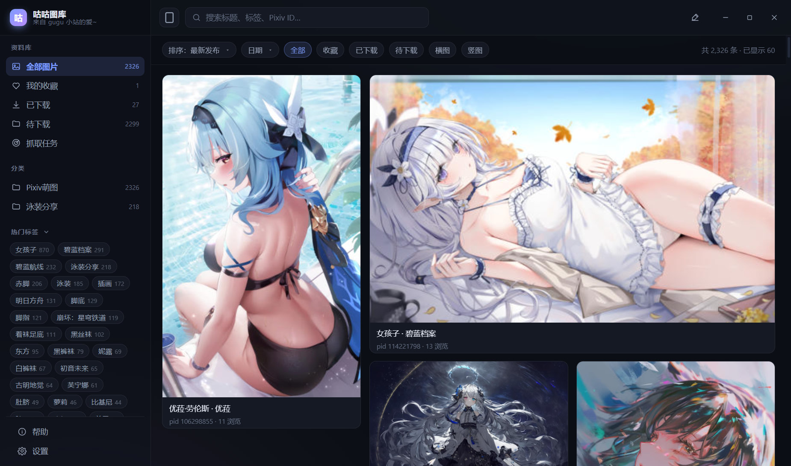
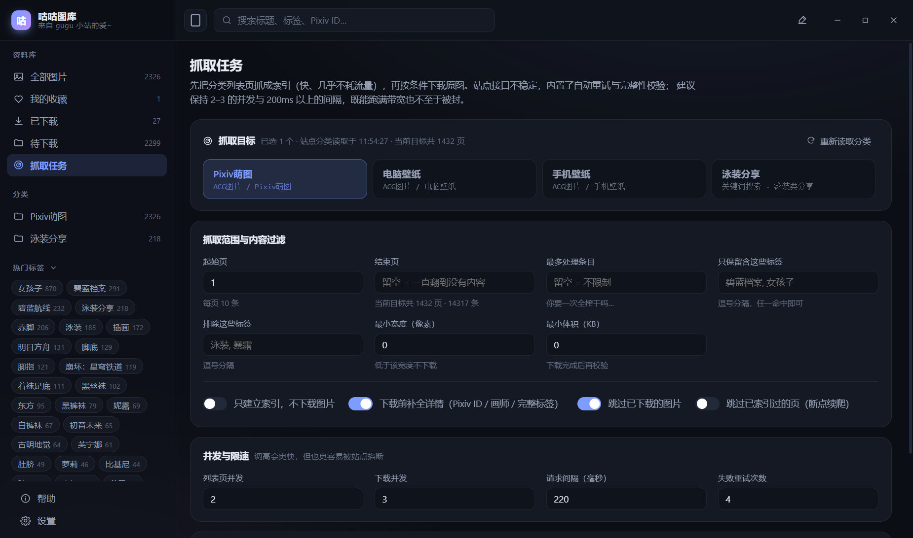

# 咕咕图库 · GuguGallery

> 针对 [咕咕小站](https://www.guguxz.com/) 的**桌面端爬虫 + 本地图库浏览器**。
> 抓取 → 索引 → 下载原图 → 生成缩略图 → 用界面翻看，全流程离线可用。

**Tauri 2（Rust）+ React 18 + TypeScript**：界面与交互完全复用，外壳换成 Rust ——
安装包 **85 MB → 2.8 MB**，可执行文件 **180 MB → 7.4 MB**，
索引改用随程序编译进来的 SQLite（不再整库常驻内存）。



---

## 目录

- [下载 & 安装](#下载--安装)
- [为什么开发](#为什么开发)
- [它长什么样](#它长什么样)
- [功能](#功能)
- [图库目录结构](#图库目录结构)
- [命令行模式](#命令行模式)
- [数据模型](#数据模型)
- [爬虫设计](#爬虫设计)
- [插件 & Skill 工具](#插件--skill-工具)
- [开发与测试](#开发与测试)
- [已知限制](#已知限制)
- [合规声明](#合规声明)

---

## 下载 & 安装

**Windows x64 安装包（约 2.8 MB）** —— 到 [**Releases**](https://github.com/LiCo16zy/gugu-gallery/releases/latest) 下载 `GuguGallery_0.7.0_x64-setup.exe`。

- NSIS 安装包，**按当前用户安装、不需要管理员**，可选安装位置，自动创建桌面 / 开始菜单快捷方式；
- 安装包里不含 WebView2 运行时（Windows 10/11 自带；缺失时安装程序会引导在线装一个几 MB 的运行时）；
- 首次启动会引导选择**图库目录**（默认建议 `图片\GuguGallery`，之后可随时在「设置 → 图库位置」里改）；
- 应用**未做代码签名**，Windows SmartScreen 可能提示「未知发布者」—— 选「更多信息 → 仍要运行」即可；
- 只提供 Windows x64 构建（Android 版本尚未开始）。想自己从源码构建，见[开发与测试](#开发与测试)。

---

## 为什么开发

某天逛到旧站，发现原来的手机软件已经不能用了 —— 干脆自己写一个。

算是兴趣驱动 + 拿真项目练手：React 手写设计系统、SQLite 索引设计、HTML 解析与站点逆向、
抓取限速与重试，以及一整套「**用页面标注驱动迭代**」的开发流程（见[插件 & Skill 工具](#插件--skill-工具)）。

最初写的是 Electron 版；后来把外壳整体换成了 **Tauri 2（Rust）** —— 界面一行没改，
主进程侧（爬虫 / 存储 / 登录态 / 插件宿主）全部重写为 Rust：安装包小了二十多倍，
常驻内存与启动时间也跟着降下来。

**仅供学习交流使用**，请勿用于商业用途或大规模镜像，详见[合规声明](#合规声明)。

---

## 它长什么样

四个主界面：**图库网格**、**灯箱详情**、**抓取任务**、**设置**。

**图库网格** —— 左侧资料库导航（全部 / 收藏 / 已下载 / 待下载 / 分类 / 热门标签），
顶部搜索与筛选，主区瀑布流，滚动到底自动加载：


**灯箱详情** —— 滚轮缩放（以光标为锚点）、左键拖动、`←` `→` 翻页、`Esc` 关闭；
右侧是完整元数据（编号 / 分辨率 / 体积 / 分类 / 发布时间 / 上传者 / Pixiv 作品号 / 本地路径）与标签，
可一键跳到 Pixiv 原作品或定位本地文件：


**抓取任务** —— 选目标、设范围与过滤条件、看它跑：



> 先 `cd src-tauri && cargo build` 编译出应用本体，再 `npm run shot`，界面的截图会输出到 `screenshots/`。

---

## 功能

**爬虫**

- 分类 / 关键词搜索 / 月排行 / 首页最新，四种抓取入口
- 两阶段流水线：先建立**索引**（只抓列表页，极省流量），再按条件**下载原图**
- 下载的是**真·原图**（站点 `dw=true` 通道），不是列表页那个压缩预览图（体积差 ~5 倍）
- 自动抓详情页补全 **Pixiv 作品 ID、画师主页、完整标签**
- 范围与过滤：起始页 / 结束页、最多处理条目、标签包含与排除、最小宽度 / 最小体积
  —— **索引与下载都严格遵守设置的范围**（每张图都记着它在列表第几页）
- 实时进度（页数 / 条目 / 下载数 / 速率）、运行日志、暂停 / 继续 / 取消
- 崩溃友好的**断点续爬**：已抓过的列表页记录在 `page_marks`，可跳过
- 下载落 `.part` 再原子改名，中断不会在库里留下半个文件

**图库**

- 瀑布流网格，标准 / 紧凑两种密度，滚动到底自动翻页
- 筛选：分类、标签（多选 AND/OR）、收藏、下载状态、横竖构图、最小宽度、**按发布月份区间**
- 七种排序：最新发布 / 最早上传 / 浏览量 / 文件体积 / 标题 / 随机
- 灯箱查看：缩放、拖拽、键盘翻页、沉浸模式、缩略图条快速跳转
- 收藏、评分、在资源管理器中打开、单张下载、连同本地文件一起两步确认删除
- 深色 / 浅色主题 + 主题色、侧栏可拖宽可收起

**分类**：只有一层 —— `Pixiv萌图` / `电脑壁纸` / `手机壁纸`，界面上不再出现「ACG图片」前缀；
登录后还会多一个 `泳装分享`（站点把它做成了关键词搜索，应用同步照做）。

**登录态（可选）**

- 站点有一部分内容（泳装分享）只在登录后可见；
- 应用**不保存账号密码**：用浏览器登录后把会话 cookie 贴进来，存进 **Windows 凭据管理器**（DPAPI 保护、绑定当前账户）；
- 应用开着时定时保活；会话失效会明确提示「cookie 已过期，请重新登录」，且只提示一次。

**稳健性**（这个站点的接口**很不稳**，这部分不是可选功能）

- 请求带 `Referer`，否则图片接口直接 403
- 完整性校验：HTML 必须以 `</html>` 收尾、图片必须 Content-Length 对得上
- 指数退避重试（默认 4 次）+ 请求节流 + 并发闸门
- 用**魔数**判断真实图片格式（站点大量存在 `.png` 实际是 JPEG 的货不对板）
- 单条失败不影响整体，队列继续推进并记入日志

---

## 图库目录结构

图库是完全自包含的：拷走就能用，没有本应用也能直接翻图。

```
<图库根目录>/
├── index.db                           SQLite 索引（元数据 + 标签 + 文件表）
├── originals/
│   └── ACG图片/
│       └── Pixiv萌图/
│           ├── 19519_碧蓝档案-小鸟游星野泳装-pid115534247.png
│           └── 19518_女孩子-插画-pid118770165.jpg
├── thumbs/
│   └── 19519.jpg                      最长边 512px 的 JPEG 缩略图
└── .tmp/                              下载中转，程序启动时自动清空
```

- 目录层级跟着站点的分类走（`一级分类/二级分类`）；没有一级分类的（关键词搜索类目标）落到 `未分类/<关键词>`。
- 文件命名可在设置里切换：`编号_标签`（默认）/ `仅编号` / `Pixiv ID` / `内容哈希`。
- 删除条目时可以只删索引，也可以连同本地文件一起删。

---

## 命令行模式

不打开界面直接抓取，适合放进计划任务：

```bash
# 先编译应用本体：cd src-tauri && cargo build

# 抓 3 页并下载，最多 60 张
npm run crawl -- --plate ACG图片 --word Pixiv萌图 --pages 3 --max 60

# 只建索引，抓 50 页
npm run crawl -- --index-only --pages 50

# 关键词搜索类目标（泳装分享）
npm run crawl -- --search --word 泳装类分享 --pages 3 --index-only

# 只保留含指定标签的图，排除另一些
npm run crawl -- --max 100 --include 碧蓝档案,女孩子 --exclude 泳装

# 指定图库目录与限速
npm run crawl -- --library D:/Pictures/GuguGallery --delay 300 --concurrency 2
```

命令行模式就是**应用本体带参数启动**（`gugu-gallery.exe --…`），走的是和界面完全一样的引擎、
HTTP 客户端与落盘逻辑，所以它同时是最省事的端到端自检（`npm run e2e` 就是这么做的）。

> 打包后的版本是 Windows 无控制台子系统：直接双击或在终端里跑不会显示输出，
> 但重定向到文件或管道（脚本里就是这么用的）一切正常。

| 参数 | 说明 |
| --- | --- |
| `--plate` / `--word` | 一级 / 二级分类，默认 `ACG图片 / Pixiv萌图` |
| `--search` | 把 `--word` 当作关键词搜索来抓（泳装分享这类目标） |
| `--from` / `--pages` | 起始页与页数 |
| `--max` | 最多处理多少条 |
| `--index-only` | 只建索引不下载 |
| `--no-enrich` | 不抓详情页（更快，但没有 Pixiv ID） |
| `--include` / `--exclude` | 标签白名单 / 黑名单，逗号分隔 |
| `--delay` / `--concurrency` | 请求间隔与并发 |
| `--library` | 图库目录（也可用环境变量 `GUGU_LIBRARY_ROOT`） |
| `--quiet` | 不打日志 |

---

## 数据模型

索引库是标准 SQLite，可以直接用任何工具打开查询。七张表：

| 表 | 作用 |
| --- | --- |
| `items` | 站点条目（一次投稿 = 一张图）：编号、标题、尺寸、体积、上传者、浏览量、发布时间、Pixiv ID、画师、站点分类（plate / word）、列表页码 `page`、原图路径、收藏 / 评分 |
| `item_targets` | 条目与「**应用分类**」的多对多关系：这条是从哪个分类抓回来的（只增不删） |
| `tags` / `item_tags` | 标签字典与多对多关系 |
| `files` | 本地已下载文件：相对路径、缩略图路径、真实格式 / 尺寸 / 体积、SHA-256 |
| `sources` | 抓取源（一级 + 二级分类 / 关键词），含条目数与最后抓取时间 |
| `jobs` | 抓取任务留痕：阶段、参数、统计、起止时间 |
| `page_marks` | 每个列表页的抓取记录，断点续爬的依据 |

`schema_version = 3`：结构变更时 +1，老库打开时自动补列 / 补表，不需要重建索引。

设计上的三个取舍：

- **条目表与文件表分开**：站点的一条投稿未来可能对应多张图（或多种规格），
  拆开之后「只索引不下载」和「下载了但没有元数据」两种状态都能自然表达。
- **缩略图路径不入条目表而入文件表**：它描述的是本地文件，不是站点数据。
  删除本地文件时只清文件表那一行，索引里的元数据还在，重新下载即可。
- **站点分类与来源分类分开**：`items.plate/word` 记的是**站点对这张图的真实分类**
  （搜索页返回的详情链接仍然指向图片原本的分类），`item_targets` 记的是**用户从哪个应用分类找到它的**。
  一开始我图省事，让抓取目标直接覆盖 `items.word`，结果是同一条记录会在两个分类之间来回跳、
  「Pixiv萌图」的计数还会莫名少掉一批 —— 分开之后就都对了。

分页用 **LIMIT/OFFSET**（`cursor` 字段就是 offset 的字符串形式）。在几万条量级下 SQLite
走覆盖索引扫偏移非常快，比 keyset 分页少一大截复杂度；真到了百万级再换 keyset 即可。

---

## 爬虫设计

完整的站点逆向笔记见 [`docs/site-analysis.md`](docs/site-analysis.md)，这里只讲结论。

### 站点要点

| 项目 | 结论 |
| --- | --- |
| 分类列表页 | `/search/index/plate/{一级}/wd/{二级}.html?page=N`，每页 10 条，页码超界返回空列表 |
| 关键词搜索页 | `/search/index/wd/{关键词}.html?page=N`（泳装分享走这条） |
| 详情页 | `/archives/image/plate/{一级}/wd/{二级}/id/{id}.html` |
| 预览图 | `/index/imageBed?item=<base64(相对路径)>` → 302 到 CDN，**压缩过** |
| 原图 | `/index/imageBed?item=<相对路径>&dw=true` → 302 到 CDN，**无损原图** |
| 防盗链 | `imageBed` 必须带 `Referer: https://www.guguxz.com/`，否则 403 |
| 拿到 CDN 签名地址后 | 再请求 CDN **不需要** Referer |
| 扩展名 | 完全不可信，`.png` 经常实际是 JPEG，必须靠魔数判断 |
| robots.txt | Disallow 为空（全站允许），本项目仍保持保守的抓取速率 |

### 关键的工程决策

**1. 为什么能从列表页直接拿到原图地址？**

列表页每张卡片的 HTML 注释里藏着原图相对路径：

```html
<!--https://files.guguxz.com/tc/?item=d/y/orig/acbab8/item/0b70bb331c620d066380564c077ed4f5.png-->

```

把 `item=` 后面的 base64 解出来就是 `d/y/orig/<桶>/item/<md5>.<扩展名>`。有了它就能直接拼
`...&dw=true` 拿原图，**不必为了下载而先访问详情页**。详情页只在需要 Pixiv ID / 完整标签时才抓一次（可开关）。

**2. 为什么重试不是可选项？**

实测这个站点的失败率：

```
直连顺序请求 12 个列表页 → 3 次失败（连接挂死 20s 或响应被截断在 618 字节）
并发 4~6 请求           → 失败率约 30%
```

失败表现是「连接挂住到超时」或「响应在中途断掉但 HTTP 状态仍是 200」。两种都不会抛网络异常，
所以必须靠**内容校验**发现：HTML 要求以 `</html>` 结尾，图片要求实际字节数等于 `Content-Length`。
发现异常就退避重试，几乎总能成功。

**3. 两阶段流水线**

```
列表页 ──解析──> items 索引（元数据 + 标签 + 原图路径 + 页码）
                      │
                      ├── 按标签/尺寸/数量/页码过滤 ──> 下载队列
                      │                                  │
                      │                            详情页补全（可选）
                      │                                  │
                      └──────────────────────────> 原图下载 ──> 魔数嗅探 ──> 落盘 ──> 缩略图
```

好处是索引极快（千页量级十几分钟，几乎不耗流量）：可以先把整站元数据拿下来，
再从容决定要下载哪些标签的图。

**4. 并发与限速**

默认列表页并发 2、下载并发 3、请求间隔 220ms。实测这个组合既能跑满带宽（约 1.4 MB/s），
失败率也压得比较低。调高会更频繁地触发上面的截断问题，但因为有重试兜底，不一定更慢 —— 建议自己试几组。

---

## 插件 & Skill 工具

仓库里有两个**可选插件**：**页面标注工具**与**开发过程档案**。
它们默认不进发布产物 —— 工具代码不该出现在给最终用户的应用里（`npm run dist` 会把它们排除，
并**实际扫描产物**确认没有残留）。插件也只在开发构建里启用：发布版连插件清单都是空的。

> **为什么做成「插件 + Skill」，而不是直接写死在项目里？**
>
> 因为这两个工具本身就值得被复用：一套是「**让人（或 AI）能指哪打哪地提界面意见**」，
> 一套是「**让每次迭代都留下可回溯的档案**」。把它们连同 `SKILL.md` 一起放进仓库，
> 别人（或别人带着 AI）接手这个项目、把这个项目的某个模块搬到自己的项目时，
> 都能**照着 Skill 文档自己把这套标注工具和档案工具搭起来**，不用重新发明一遍。
>
> 换句话说：**代码是可复用的代码，Skill 是可复用的说明书**。

### 页面标注工具

> 可选插件 `plugins/annotator` ｜ 说明书 [`plugins/annotator/SKILL.md`](plugins/annotator/SKILL.md)

专门为「审阅界面 → 提修改意见」做的工具，开发模式下**按 `Ctrl+Shift+A` 打开**（顶栏右侧也有个笔形按钮）。

1. 打开后默认是**浏览**模式，不拦截任何点击 —— 正常操作应用，翻到你想提意见的那一屏；
2. 切到**点选**：鼠标悬停实时高亮元素并显示它属于哪个组件；点一下某个元素即可写批注；
3. 或者切到**框选**：按住左键拖出一个矩形，给一整片区域提意见；
4. 每条批注可以标类别（视觉样式 / 布局结构 / 文案内容 / 交互行为 / 缺陷 / 其它）与优先级（必须改 / 建议改 / 锦上添花）；
5. 右下角「标注清单」可以回看、跳转、编辑、删除；点「导出标注」→ 填一句总体说明 → 确认。

导出会在 `devlog/rounds/` 下生成一个新轮次目录，包含：

- `annotations.md` / `annotations.json` —— 每条批注的**原文**，外加自动采集的执行信息：
  **组件名、CSS 选择器、父级链、元素文本、关键计算样式（字号 / 颜色 / 间距 / 圆角 / 阴影…）、WCAG 对比度**、标注框坐标尺寸；
- `screenshots/00-full.png` —— 导出时的整页截图；
- `screenshots/001-xxx.png` —— **每条标注自动裁切的局部截图**。

> 为什么记录得这么细：批注里写「这个按钮太小」是无法执行的，而执行改动的人（或 AI）未必看得到界面。
> 工具把选择器、当前字号、当前颜色、当前间距全都记下来，拿到 `annotations.md` 就能定位到源码、
> 知道当前值是多少、要改成什么。
>
> 标注只会写进 `devlog/`，**不会修改任何代码**，可以放心多点几下。

### 开发过程档案

> 可选插件 `plugins/devlog` ｜ 说明书 [`plugins/devlog/SKILL.md`](plugins/devlog/SKILL.md)

每一轮迭代的「快照 + 说明 + 前后对照截图」都归档在 `devlog/`，轮次索引见 `devlog/index.json`。

**平时改代码只管 commit 就行，不需要每次都建档案**；只在有体量的迭代（一批界面修改、一次重构、一个功能从无到有）时才开一轮。

```bash
npm run round -- inbox               # 打印最新未收尾轮次的内容（拿到反馈的标准入口）
npm run round -- list                # 列出所有轮次
npm run round -- new <slug>          # 开一轮：建目录 + 起始截图 + 元数据
npm run round -- finalize <轮次ID>   # 收尾：改动后截图 + 代码 diff + 更新说明 + 打 tag
```

每个轮次目录长这样：

```
devlog/rounds/0002-xxx/
├── README.md             背景 / 改动 / 验证 / 遗留
├── annotations.md        界面标注原文（人会读的版本）
├── annotations.json      界面标注原始数据（机器可读）
├── changes.md            代码差异概览（变更文件清单 + 统计）
├── changes.patch         完整代码差异，可 git apply
├── screenshots/          本轮界面截图
├── screenshots-before/   改动前（用于前后对照）
└── screenshots-after/    改动后（用于前后对照）
```

收尾时会自动打一个 `round/<轮次ID>` 的 git tag，所以任何一轮都能用 `git checkout round/0002-xxx` 完整复原。
起点是 [`devlog/rounds/0001-baseline/`](devlog/rounds/0001-baseline/README.md)；
本 README 之前的版本归档在 [`docs/archive/README-v0.6.3.md`](docs/archive/README-v0.6.3.md)。

---

## 开发与测试

```bash
# 需要 Node >= 20 与 Rust 工具链
# （本机 Rust 装在 ~/.cargo/bin，不在 PATH 上就先 export PATH="$HOME/.cargo/bin:$PATH"）
npm install

npm run dev                   # 开发模式：demo 图库 + 插件（标注工具）+ 界面热更新
cd src-tauri && cargo build   # 只编译应用本体（界面自检都跑在它上面）
npm run dev:web               # 只起渲染层开发服务器（调样式时用）
npm run tauri:dev             # 开发模式：但用你自己的设置与图库

npm run typecheck             # 渲染层严格类型检查
npm test                      # 前端单测：应用分类表（7 例）
cargo test --manifest-path src-tauri/Cargo.toml   # Rust 单测：解析器（16 例）
npm run uicheck               # 启动真实界面点一遍关键路径（63 项交互断言）
npm run annotatecheck         # 驱动标注工具走完「点选 → 批注 → 框选 → 导出」（37 项断言）
npm run e2e                   # 真连目标站点跑一次端到端（需要联网）
npm run shot                  # 自动截图四个界面到 screenshots/

npm run pack                  # 发布构建（release 可执行文件，不打包安装包）
npm run dist                  # 发布构建 + NSIS 安装包（自动走无插件构建并扫描产物）
```

**本地跑起来**

```bash
# 1) 一站式开发模式：demo 图库 + 插件（页面标注工具按 Ctrl+Shift+A）+ 界面热更新
npm run dev

# 2) 只调样式：起前端服务器，浏览器打开 http://localhost:5173
#    （浏览器里没有 window.gugu，数据是空的，只适合看样式与布局）
npm run dev:web

# 3) 直接跑发布产物（前端已经嵌在 exe 里，不需要额外起服务器）
src-tauri/target/release/gugu-gallery.exe
```

> 在 Git Bash 里跑 exe，stdout/stderr 能直接看到（发布版是无控制台子系统：
> 输出进管道或文件正常，直接双击看不到打印）。
> **`WebView2Loader.dll` 必须和 exe 放在同一个目录** —— windows-gnu 工具链下它是动态依赖，
> 缺了会立刻报 `error while loading shared libraries: WebView2Loader.dll`；
> `target/release/` 与安装目录里都会有一份。

五层验证各有分工：

| 命令 | 覆盖范围 | 是否需要联网 |
| --- | --- | --- |
| `cargo test` | 列表页 / 详情页解析、分页、导航、URL 规则（16 例） | 否 |
| `npm test` | 应用分类表（7 例） | 否 |
| `npm run uicheck` | 渲染、筛选、搜索、灯箱、键盘、主题、分类、登录引导 | 否（用本地图库） |
| `npm run annotatecheck` | 标注工具的交互与导出产物 | 否（用临时目录） |
| `npm run e2e` | 真实抓取 → 下载 → 落盘 → 缩略图 | 是 |
| `npm run dist` | 产物里不含任何插件代码 | 否 |

- 单元测试用的是**真实抓下来的 HTML 样本**（`tests/fixtures/`），站点改版时测试会第一时间失败；
  Rust 侧解析器单测与旧版 vitest 用的是同一批样本。
- `e2e` / `uicheck` / `shot` 支持用环境变量隔离：`GUGU_LIBRARY_ROOT` 指定图库目录、
  `GUGU_SETTINGS_FILE` 指定配置文件、`GUGU_USER_DATA` 指定用户数据根目录、
  `GUGU_SESSION_EPHEMERAL=1` 表示不碰系统凭据库
  （自检不会碰到你日常使用中的设置与登录态）。
- `uicheck` 与 `shot` 靠应用内建的 `GUGU_SHOT` / `GUGU_EVAL` / `GUGU_DIAG` 钩子驱动：
  窗口截图走 `PrintWindow`，注入脚本的结果以 `__EVAL__{…}` 打到 stdout ——
  harness 约定与 Electron 版完全一致，所以自检脚本只是换了启动方式。
- **打包提示**：Tauri 的 NSIS 工具链来自 GitHub Release 资产。本机直连
  `objects.githubusercontent.com` 不通，已把工具链缓存放进 `%LOCALAPPDATA%\tauri\`
  （NSIS 3.11 + WebView2 引导程序），打包阶段完全离线；换机器或清缓存后怎么补，
  见 [`docs/release-process.md`](docs/release-process.md)。
- **网络提示**：`cargo build` 首次要从 crates.io 拉依赖（不通的话在 `~/.cargo/config.toml` 里配镜像）；
  `npm install` 只装前端依赖，不再需要下载 Electron 二进制。

### 代码结构

```
src-tauri/                    应用本体（Rust）—— 发布产物就是它
├── src/
│   ├── main.rs               入口：命令注册、窗口、自定义协议、自检钩子
│   ├── cli.rs                无界面命令行模式 + imgdiff
│   ├── shot.rs               窗口截图（PrintWindow）与 GUGU_SHOT 流程
│   ├── library.rs            图库目录布局与越权检查
│   ├── settings.rs           设置持久化（userData/settings.json）
│   ├── session.rs            会话 cookie（Windows 凭据管理器）与校验
│   ├── media.rs              自定义协议 gugu:// → 缩略图 / 原图
│   ├── store/                索引库：schema / 查询 / 写入
│   ├── crawler/              site / parser / http / engine（+ 解析器单测）
│   └── plugins/              插件宿主 + devlog（轮次档案 / 标注导出）
├── build.rs                  版本号与仓库根注入
├── tauri.conf.json           窗口、CSP、打包配置
└── icons/                    应用图标

src/renderer/                 React 界面（无 UI 库，纯手写 CSS 设计系统）
└── src/
    ├── App.tsx               壳：布局、路由、状态、插件插槽
    ├── tauri-bridge.ts       把 Tauri 的 invoke/listen 装成 window.gugu
    ├── plugins.ts            插件宿主（渲染侧）
    ├── api.ts                桥接 + 展示层格式化
    ├── styles.css            设计系统
    └── components/           Sidebar / GalleryGrid / Lightbox / CrawlPanel / SettingsPanel / LoginGuide / Icons

src/shared/                   两端共享的纯类型与纯函数
    ├── types.ts              领域模型
    ├── bridge.ts             window.gugu 的 API 契约（外壳唯一耦合点）
    ├── plugin.ts             插件契约
    └── categories.ts         应用分类表（含单测）

plugins/                      可选工具 —— 默认不进发布产物
├── plugins.json              装载清单
├── annotator/                页面标注工具（renderer + bin + SKILL.md）
└── devlog/                   开发过程档案（shared + bin + SKILL.md，主进程侧在 Rust）

scripts/                      仓库级工具
├── tauri-app.mjs             起 Vite / 跑应用本体的公共部分
├── shot.mjs                  界面截图
├── uicheck.mjs               界面交互回归
├── annotatecheck（插件内）    标注工具自检
├── e2e.mjs                   真实站点端到端（走命令行模式）
├── crawl.mjs                 命令行抓取包装
└── release.mjs               无插件发布构建 + 产物校验
```

完整分层说明与设计取舍见 [`docs/architecture.md`](docs/architecture.md)，
插件契约与开发指南见 [`docs/plugin-development.md`](docs/plugin-development.md)。

**安全边界**：渲染进程没有 Node 集成，只能通过 `window.gugu` 调用注册过的命令；
所有文件访问都经过 `Library.resolve_inside()` 做越权检查；页面加载了 CSP，
图片只能来自 `gugu://` 自定义协议或本地 `data:`/`blob:`；
外链只放行 `http/https`。账号密码从不经过本应用：登录态只保存站点会话 cookie，
且存在 Windows 凭据管理器里。

---

## 已知限制

- **登录态只覆盖「会话 cookie」这一条路**：站点需要过验证码，所以不做自动登录；cookie 过期后需要重新贴一次。站点没有提供长效凭据，应用侧拿不到更长的授权。
- **索引是本地 SQLite 文件**：随程序一起编译进 `rusqlite`（bundled），不再整库常驻内存；单连接串行写入，抓取与界面查询共用它，十万条量级依旧流畅。
- **不做图片去重**：同一张图重复投稿会各自存一份。
- **抓取速率保守**：默认并发 2~3、间隔 220ms，抓完整站需要等待一段时间。
- **只提供 Windows x64 构建**，且未做代码签名，安装未签名安装包时 SmartScreen 会提示「未知发布者」。

---

## 合规声明

- 本项目仅用于**个人离线浏览与学习研究**，请勿用于商业用途或大规模镜像。
- 抓取到的图片**版权归原作者与投稿人所有**，转载 / 二次使用请遵守原站规则与 Pixiv 作者授权。
- 请遵守目标站点的 robots.txt 与服务条款，**保持合理抓取速率**，不要给站点造成压力。
  项目默认值偏保守，调高并发与降低间隔造成的后果由使用者自行承担。
- `tests/fixtures/` 与文档里的 HTML 样本、界面截图仅用于解析器回归测试与功能说明。
- 本仓库采用 [MIT 许可](LICENSE)。
